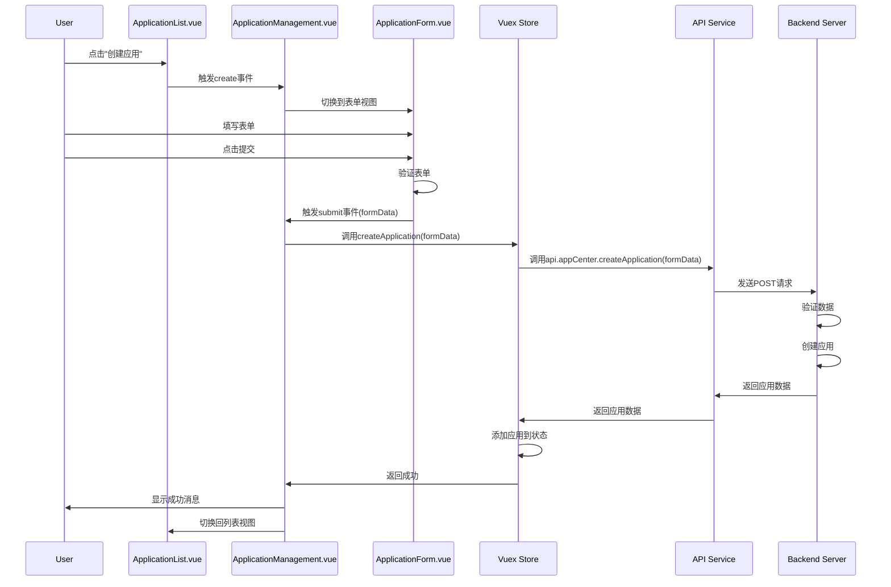
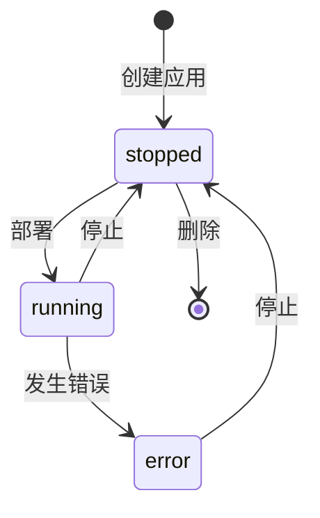
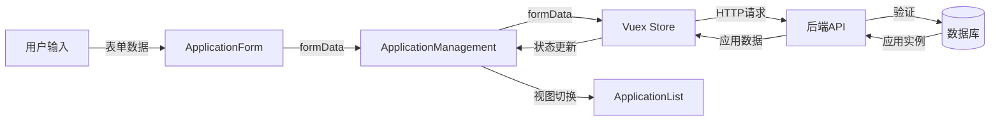

# 应用创建流程图

以下流程图展示了应用创建的完整流程：

```mermaid
graph TD
    A[用户点击"创建应用"按钮] --> B[切换到表单视图]
    B --> C[填写应用表单]
    C --> D[验证表单数据]
    D -->|不通过| C
    D -->|通过| E[提交表单]
    E --> F[调用Vuex createApplication action]
    F --> G[发送API请求到后端]
    G --> H[后端验证数据]
    H -->|不通过| I[返回错误信息]
    I --> C
    H -->|通过| J[创建应用实例]
    J --> K[返回应用数据]
    K --> L[更新前端状态]
    L --> M[显示成功消息]
    M --> N[切换回列表视图]
```

## 组件交互图

以下图表展示了不同组件之间的交互关系：



## 应用状态转换图

以下状态转换图展示了应用在不同状态之间的转换：



## 数据流图

以下数据流图展示了应用创建过程中的数据流向：

